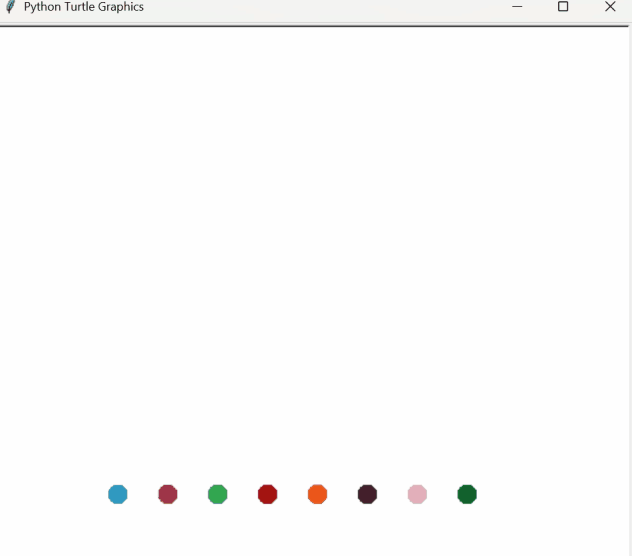

<h2>Turtle & the Graphical User Interface (GUI)</h2>
<h2>Concepts</h2>
<ul>
  <li>Understanding Turtle Graphics and How to use the Documentation</li>
  <li>Importing Modules, Installing Packages, and Working with Aliases</li>
</ul>
<h2>Hirst Painting Project</h2>

