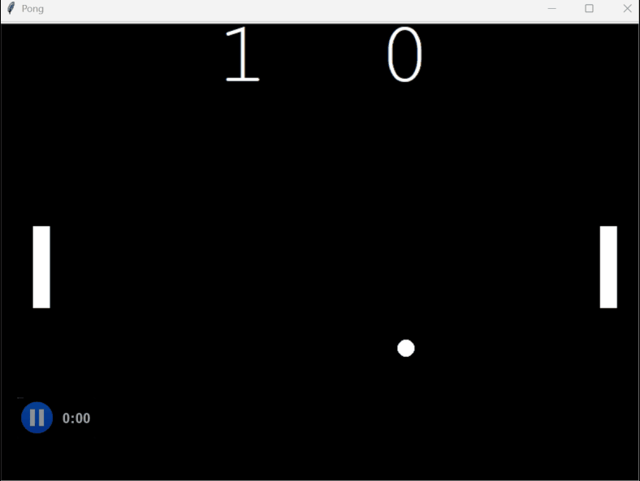

<h2>Build Pong: The Famous Arcade Game</h2>
<h3> Concepts: </h3>
<ul>
<li>Create a Paddle that responds to Key Presses</li>
<li>Write the Paddle Class and Create the Second Paddle</li>
<li>Write the Ball Class and Make the Ball Move</li>
<li>Add the Ball Bouncing Logic</li>
<li>How to Detect Collisions with the Paddle</li>
<li>How to Detect when the Ball goes Out of Bounds</li>
<li>Score Keeping and Changing the Ball Speed</li>
</ul>
<h3>Pong</h3>

